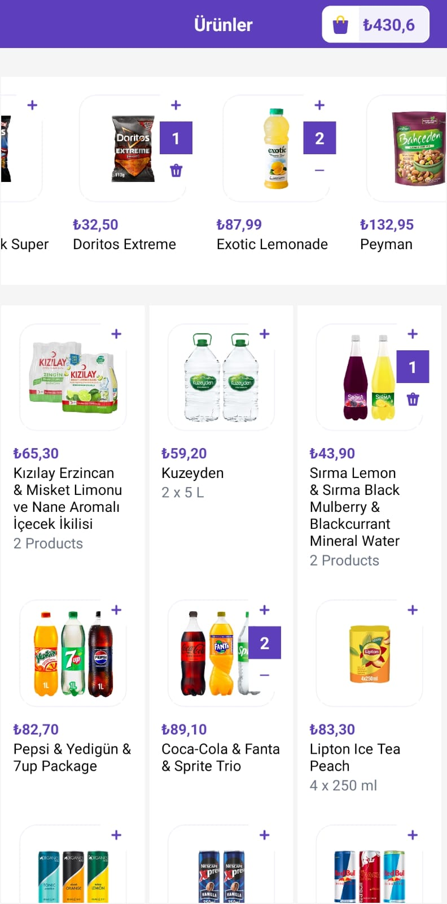
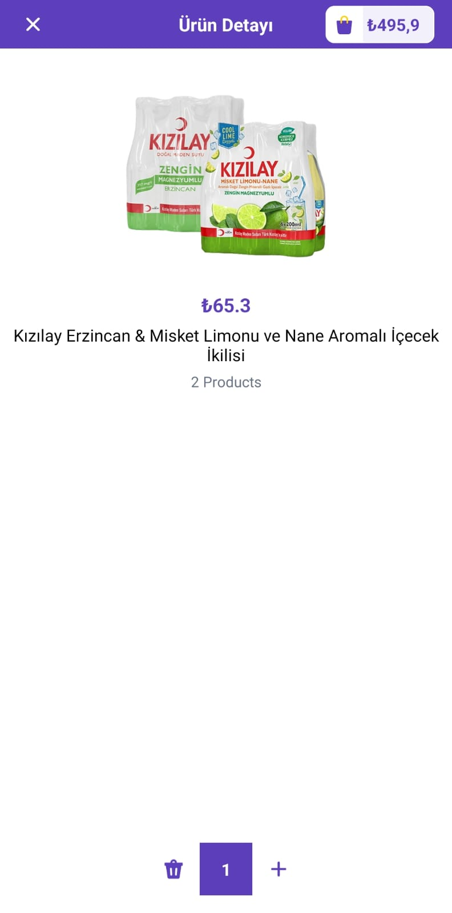
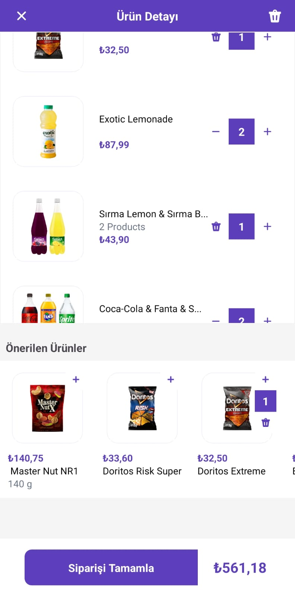

# Getir Android Kotlin Bootcamp Final Project

This repository contains the source code for the final project of the Patika / Getir Android Kotlin Bootcamp. This application is designed following the Model-View-ViewModel (MVVM) architecture to demonstrate a robust, maintainable, and scalable approach to Android development.

## Overview

The project is a simplified clone of an e-commerce app similar to Getir, showcasing product listing, adding products to a cart, and managing them through various screens. It utilizes modern Android development tools and practices.

## Screenshots
| Home Screen | Product Detail | Shopping Cart |
|:-----------:|:--------------:|:-------------:|
|  |  |  |


## Demo Video
You can watch demo video on [Youtube](https://youtube.com/shorts/Fmz_uCSk6io?feature=share)

## Features

- Product listing via horizontal and vertical scrolling views.
- Access detailed information about each product through a dedicated detail page.
- Add products to and remove products from the shopping cart.
- View cart and modify its contents.
- Use of LiveData to observe data changes and update the UI accordingly.
- Navigation Component for handling fragments.
- Asynchronous data fetching and updates with Kotlin Coroutines.

## Architecture

This app is built using the **Model-View-ViewModel (MVVM)** architecture which facilitates separation of concerns and makes the codebase more manageable and testable. Repository pattern is also integrated to provide a clean API for data access to the rest of the application.

## Technologies Used

- **Kotlin Coroutines** for managing background threads with simplified code and reducing needs for callbacks.
- **Retrofit** for network HTTP requests.
- **Gson** for serialization and deserialization of Java and Kotlin objects to JSON.
- **Picasso** for image loading.
- **Android Jetpack Components**:
  - **LiveData** - for observing data changes and updating the UI.
  - **ViewModel** - to manage UI-related data in a lifecycle-conscious way.
  - **Navigation Component** - to manage app navigation within a single activity.

## Dependencies

```gradle
var retrofitVersion = "2.9.0"
val nav_version = "2.7.7"
dependencies {
    implementation("org.jetbrains.kotlinx:kotlinx-coroutines-android:1.8.1-Beta")
    implementation("org.jetbrains.kotlinx:kotlinx-coroutines-core:1.8.1-Beta")

    implementation("com.squareup.retrofit2:retrofit:2.9.0")
    implementation("com.squareup.retrofit2:converter-gson:2.9.0")

    implementation("com.squareup.picasso:picasso:2.71828")

    implementation("androidx.lifecycle:lifecycle-viewmodel-ktx:2.3.1")

    implementation("androidx.navigation:navigation-fragment-ktx:2.3.5")
    implementation("androidx.navigation:navigation-ui-ktx:2.3.5")
}
```

## Contact
[LinkedIn](https://www.linkedin.com/in/turgayozdemircom/)

[turgayozdemir.com](https://turgayozdemir.com/)